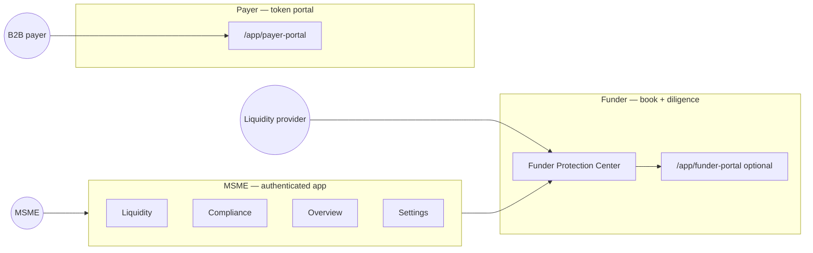
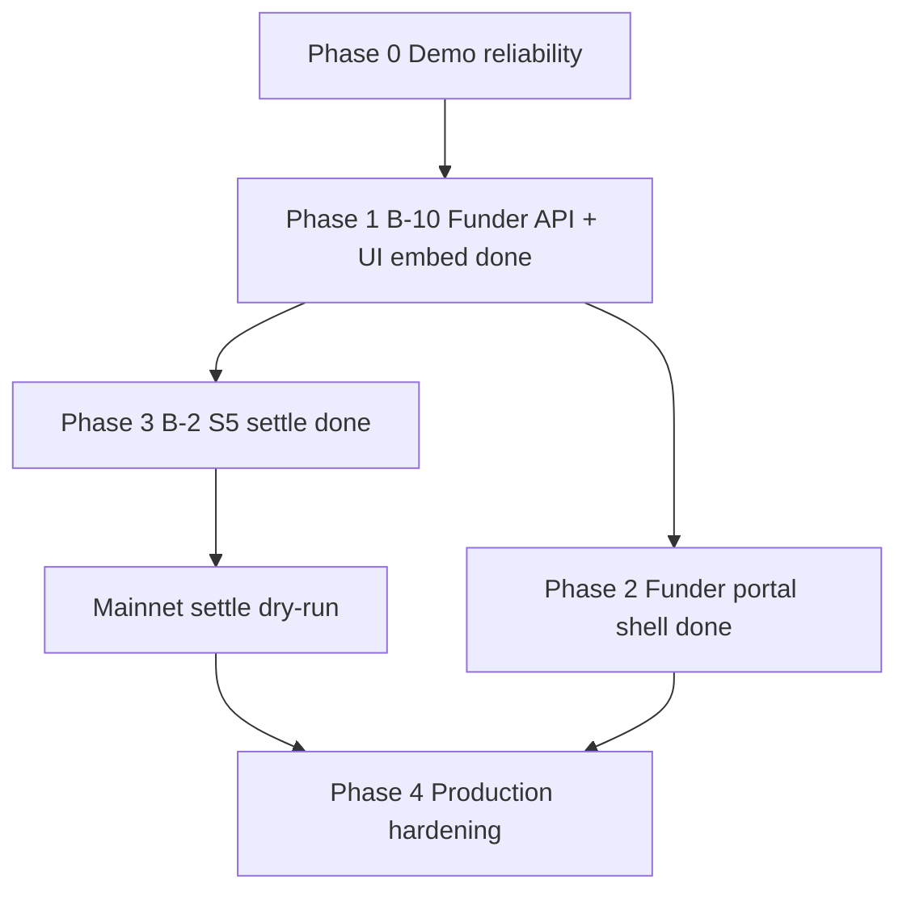

# Axial — Alignment Plan (Product · Architecture · Build)

**Version:** 1.0  
**Date:** 2026-06-14  
**Status:** Canonical roadmap for aligning PRD, docs, and code  
**Owner:** Team (update status in [`sprint.md`](sprint.md) as tasks land)

> **Purpose:** One plan so MSME app, payer portal, funder visibility, closed-loop settlement, compliance, and docs stay consistent long-term. When this conflicts with [`Axial.md`](Axial.md) locked decisions, **update [`Axial.md`](Axial.md) first**, then this file.

**Related:** [`remaining-work-axial.md`](remaining-work-axial.md) · [`flow.md`](flow.md) · [`prd-axial.md`](prd-axial.md) · [`sprint.md`](sprint.md) · [`rfc-axial-closed-loop-settlement.md`](rfc-axial-closed-loop-settlement.md)

---

## 1. North star (unchanged)

**Tagline:** Instant capital, effortless compliance.

**Three problems, one pipeline:**

| Problem | On-chain | Off-chain |
|---------|----------|-----------|
| MSME cash-flow gap (Net 60–90) | Mint + swap (USDC) | Invoice OCR, eligibility |
| Statutory payroll | Payroll split | — |
| BIR EIS (Phase 1 taxpayers) | Events → memo | Oracle + mock/live BIR |

**Operating network:** Stellar Mainnet only. **Settlement asset:** USDC. **User-facing:** PHP.

**Market:** Philippines-first wedge; **SEA-expandable** via compliance rule packs (see §8).

---

## 2. Three actors · three surfaces (align everything to this)

| Actor | Primary surface | Auth (v1 → prod) | Core actions |
|-------|-----------------|-------------------|--------------|
| **MSME** | 4-tab app (`/app/*`) | Supabase org session | Upload, confirm payer, tokenize & swap, payroll, EIS view |
| **Payer** | Payer portal | Magic link `token` | Confirm invoice, e-ack NoA, pay lockbox (Freighter) |
| **Funder** | Funder Protection Center | Embed in Liquidity → invite/login portal | View book, diligence checklist, leakage alerts (**read-only v1**) |

**Alignment rule:** Payer logic stays in payer APIs + portal. Funder logic stays in **`/api/funder/*` + shared components** — never duplicated inside Liquidity table code.

**What exists today:**

| Surface | Status |
|---------|--------|
| MSME 4-tab app | ✅ |
| Payer portal | ✅ |
| Funder Protection Center | ✅ embedded in Liquidity + `/app/funder-portal` |
| Standalone funder portal | ✅ `/app/funder-portal` (token or session auth) |

---

## 3. Locked architecture (do not fork)

| Decision | Value | Implication for funder work |
|----------|-------|----------------------------|
| Backend | Next.js route handlers in `web/app/api/` | New routes under `api/funder/` |
| Persistence | Supabase + file fallback | `reserve_ledger`, `factoring_invoices`, payers/NoA |
| Chain signing (demo) | Custodial server (`GB6TMT…`) | Funder book shows server funder pubkey |
| Chain signing (roadmap) | Freighter for MSME/payer; optional funder later | Portal v1 read-only; swap stays Liquidity |
| Closed loop | Payer confirm + NoA before fund | Funder diligence reads same eligibility fields |
| Settlement | `register_invoice` ✅ · `settle` ✅ S5 | Funder UI shows **expected vs collected**; Repaid / Partial / Leaked after settle |
| IA | Four tabs for MSME | Funder center **embeds in Liquidity**, not a fifth tab |
| Funder portal (external) | Optional second shell | Same API/components as embedded panel |

---

## 4. Phased roadmap (build order)

### Phase 0 — Demo reliability (P0, now)

**Goal:** Website happy path matches what we invoke on-chain.

| Task | ID | Deliverable |
|------|-----|-------------|
| Liquidity: reject demo mint/swap without tx hash | — | Toast shows real errors |
| Auto-seed / load demo book on prod | — | Empty Active Factoring fix |
| Dry runs + recording | S0-6 | [`sprint.md`](sprint.md) shot list |
| Docs verification | S0-7 | [`Axial.md`](Axial.md) + [`flow.md`](flow.md) match code |

**Exit criteria:** One fundable invoice → Tokenize → toast with **Mint + Swap** hashes → Compliance EIS row → optional payroll tx.

---

### Phase 1 — Funder domain (B-10) · API-first

**Goal:** US-06 satisfied in UI; no duplicate logic.

#### 1.1 Domain layer

Create `web/lib/funder/book.ts`:

- `listFunderBook(page, pageSize, funderAddress?)`  
- `getFunderDeal(receivableId)`  

**Joins:**

- `factoring_invoices` — face, immediate, status, mint/swap txs, `trust`  
- `reserve_ledger` — advance, reserve, due_date, recourse_status, shortfall  
- `payers` + confirmation + NoA — KYB, ack status, lockbox  
- `checkFundingEligibility()` — blockers for diligence view  

**Types:** `FunderDealRow`, `FunderDiligence` (payerKyb ✓, confirmed ✓, noa ✓, advanceBps, reserveHeld, recourseStatus).

#### 1.2 API

| Method | Path | Auth |
|--------|------|------|
| GET | `/api/funder/book?page=&pageSize=` | Org session (v1); filter by `MAINNET_STELLAR_FUNDER_PUBLIC` |
| GET | `/api/funder/deals/[receivableId]` | Same |

#### 1.3 Shared UI components

| Component | Location | Used by |
|-----------|----------|---------|
| `FunderProtectionCenter` | `web/components/funder/` | Liquidity embed |
| `FunderDealDrawer` | same | Row expand |
| `FunderDiligenceBadges` | same | KYB / confirm / NoA / reserve |
| `FunderTxLinks` | reuse `LiquidityView` pattern | mint, swap, lockbox |

#### 1.4 Embed in Liquidity

- New section below Active Factoring: **“Treasury & funder book”**  
- Pull treasury USDC from existing `/api/dashboard/summary`  
- Table from `/api/funder/book`  

**Exit criteria:** Funder (or demo operator) sees all settled/in-flight deals with US-06 checklist without reading Supabase manually.

---

### Phase 2 — Funder portal shell (B-10b)

**Goal:** External LP view without MSME org login.

| Task | Deliverable |
|------|-------------|
| Route `/app/funder-portal` | Thin page like payer portal |
| `FunderPortalView` | Renders same `FunderProtectionCenter` |
| Auth v1 | Invite token **or** read-only public demo mode with org session |
| Auth prod | Supabase login + `org_memberships.role = 'funder'` |

**Do not** reimplement book queries in the portal — only auth + layout differ.

**Exit criteria:** Shareable URL for judges / LP; same data as Liquidity embed.

---

### Phase 3 — Closed loop completion (B-2 S5–S6) · ✅ done (verify on Mainnet)

**Goal:** Funder book shows **repaid**, not just **advanced**.

| Task | ID | Funder UI impact |
|------|-----|------------------|
| Wire `settleOnChain` | S5 ✅ | Deal status → **Repaid** / **Partial** / **Leaked** |
| Reconcile with contract balance | S5 ✅ | `collectedAmount` on deal row |
| Attribution / trust model doc | S6 ✅ | Update [`rfc-axial-closed-loop-settlement.md`](rfc-axial-closed-loop-settlement.md) |
| Overview leakage chip | — ✅ | “N deals at risk” from book API |

**Exit criteria:** Payer pays lockbox → admin/cron settle → funder book shows repayment + reserve release. **Remaining:** Mainnet dry-run via [`settle-dry-run-checklist.md`](settle-dry-run-checklist.md).

---

### Phase 4 — Production hardening (P1)

| Track | Tasks | Doc |
|-------|-------|-----|
| **Ops** | GCP Cloud Scheduler for 3 crons | [`remaining-work-axial.md`](remaining-work-axial.md) §4 |
| **Compliance** | Live BIR when PTT granted | B-7, [`clr-axial.md`](clr-axial.md) |
| **KYB** | Real payer vendor | [`flow.md`](flow.md) matrix |
| **Auth** | `funder` role + RLS on book queries | migration `007` |
| **Legal** | NoA + Terms counsel review | CLR |
| **Optional** | Funder Freighter signs `execute_advance` | Post-v1 |

---

## 5. B-10 task breakdown (sprint-ready)

Add to [`sprint.md`](sprint.md) as **B-10 · Funder Protection Center**.

| Step | Task | Est. | Status |
|------|------|------|--------|
| B-10.1 | `lib/funder/book.ts` + types | 0.5d | ✅ |
| B-10.2 | `GET /api/funder/book` | 0.5d | ✅ |
| B-10.3 | `GET /api/funder/deals/[id]` | 0.25d | ✅ |
| B-10.4 | `FunderProtectionCenter` components | 1d | ✅ |
| B-10.5 | Embed in `LiquidityView` | 0.5d | ✅ |
| B-10.6 | Overview “at risk” chip | 0.25d | ✅ |
| B-10.7 | `/app/funder-portal` + token auth | 1d | ✅ |
| B-10.8 | Update docs matrix (flow, Axial, remaining-work) | 0.25d | ⬜ |

**Dependencies:** None remaining for B-10.1–7. B-10 deal **repaid** state unblocked — **B-2 S5** settle is wired (verify on Mainnet).

---

## 6. Doc alignment checklist

When B-10 or S5 lands, update in order:

1. [`Axial.md`](Axial.md) — Implementation status table  
2. [`flow.md`](flow.md) — §7 matrix: Funder portal → 🟡 then ✅; add funder to sequence §3  
3. [`remaining-work-axial.md`](remaining-work-axial.md) — Mark B-10 done; remove “v1 skip”  
4. [`sprint.md`](sprint.md) — B-10 status  
5. [`prd-axial.md`](prd-axial.md) — US-06 traceability (optional footnote)  
6. Demo script [`pbw-script.md`](pbw-script.md) / [`product-walkthrough.md`](product-walkthrough.md) — Add 30s “Funder Protection Center” beat (not the superseded [`pitch-script.md`](pitch-script.md))  

**flow.md row change (target):**

| Feature | Was | Target |
|---------|-----|--------|
| Funder Protection Center | Could · ❌ v1 skip | Should · ✅ embedded · ✅ + portal |
| Funder repaid + reserve release | ⬜ E3 | ✅ after S5 (verify on Mainnet) |

---

## 7. Demo narrative (aligned shot list)

Order for video / judges — maps to three surfaces:

1. **Overview** — treasury USDC, EIS pulse  
2. **Liquidity** — seed/upload → confirm payer  
3. **Payer portal** — (optional cut) confirm + NoA + lockbox pay  
4. **Liquidity** — tokenize & swap (show tx hashes)  
5. **Liquidity → Funder Protection Center** — diligence ✓ on that deal  
6. **Compliance** — EIS row + payroll route  
7. **Settings** — network mainnet, PDAX mock  

**SEA pitch add-on (one line):** “PH compliance pack shipped; swap rule packs per ASEAN market.”

---

## 8. SEA expansion (future, aligned architecture)

Do **not** fork contracts per country. Fork **compliance packs**:

| Pack | Contents |
|------|----------|
| PH (v1) | BIR EIS, SSS/PhilHealth/Pag-IBIG, PDAX, PH NoA |
| SG / ID / TH (future) | E-invoice schema, statutory payroll %, local anchor, assignment law |

Funder book API stays country-agnostic; add `jurisdiction` column on org/deal when expanding.

---

## 9. Dependency graph

**Status:** B-10.1–7 and S5 are ✅ in code; funder “Repaid” column is unblocked. Remaining: Mainnet verify + Phase 4 production hardening.

---

## 10. Success metrics

| Phase | We know we’re aligned when |
|-------|----------------------------|
| 0 | Demo works in UI without manual API calls |
| 1 | One API powers funder table; US-06 visible per deal |
| 2 | LP opens `/app/funder-portal` and sees same book |
| 3 | Lockbox payment → settle → funder row shows Repaid |
| 4 | Crons run on schedule; docs match code; legal gate documented |

---

## Changelog

| Date | Change |
|------|--------|
| 2026-06-14 | Initial alignment plan: three surfaces, B-10 phases, doc checklist, SEA note |
