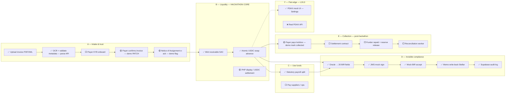
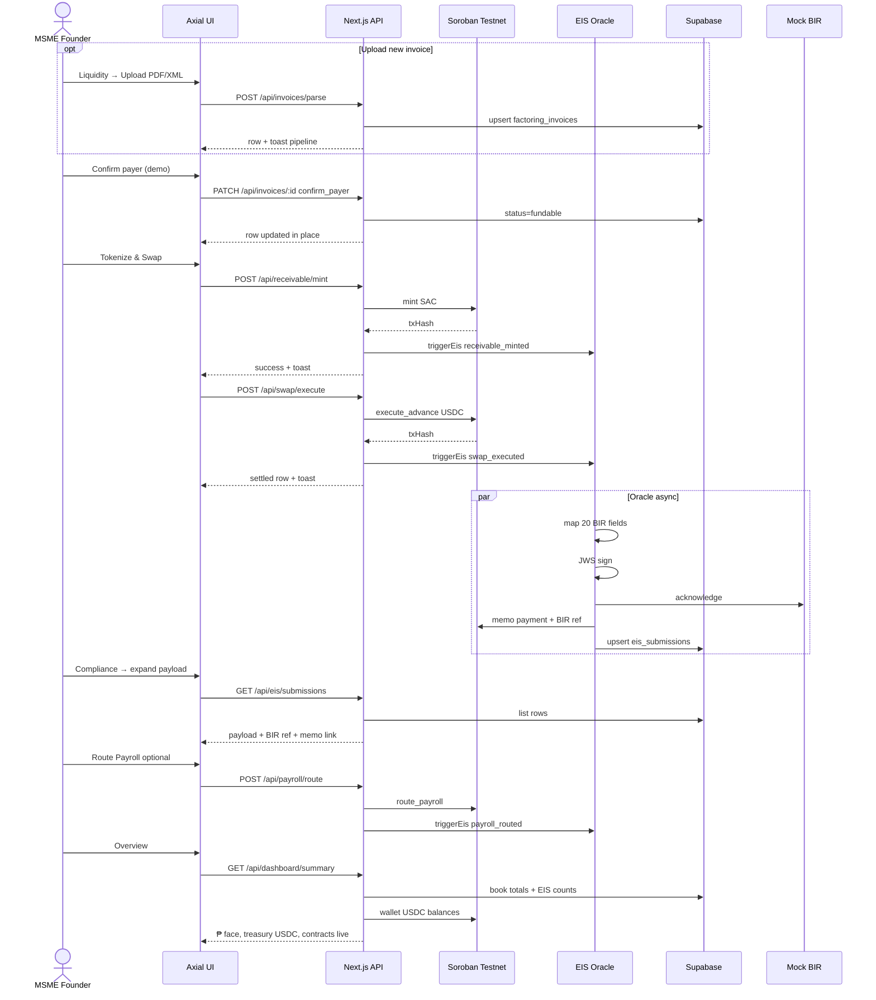
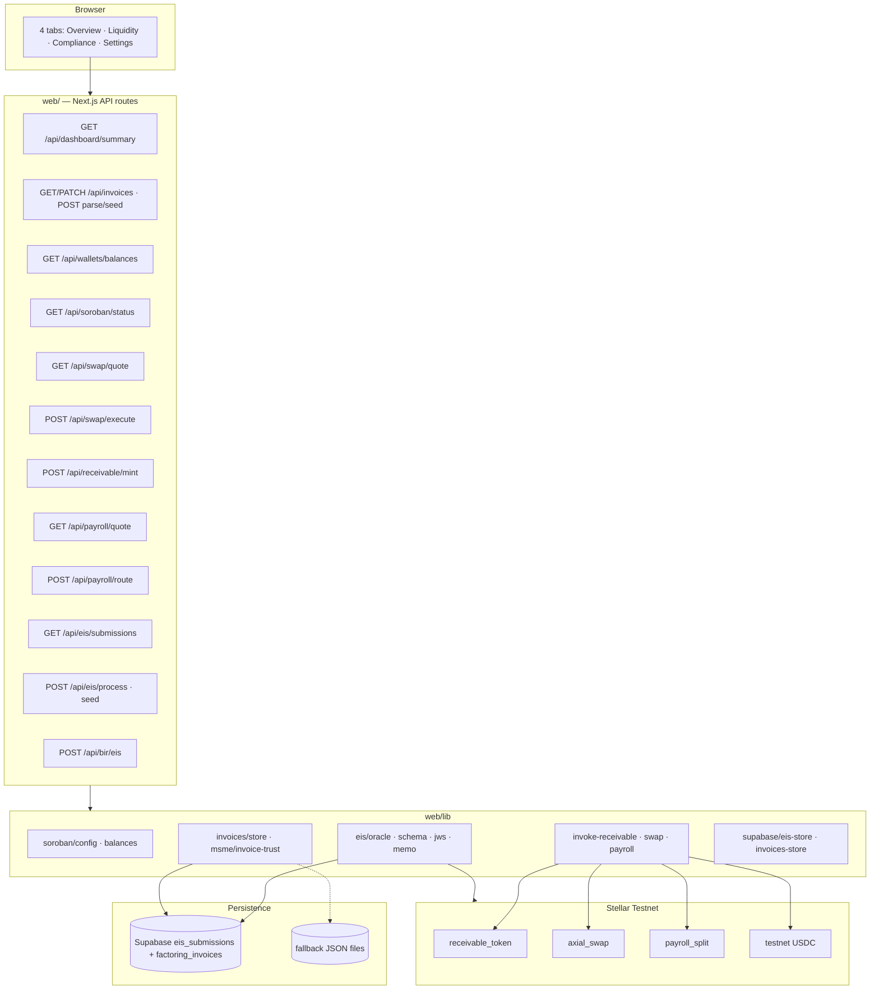
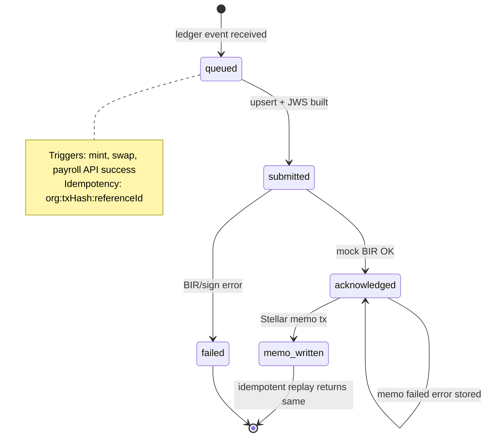
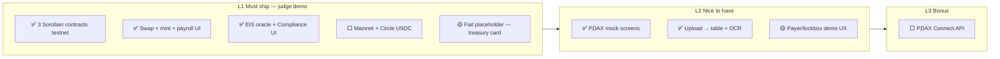
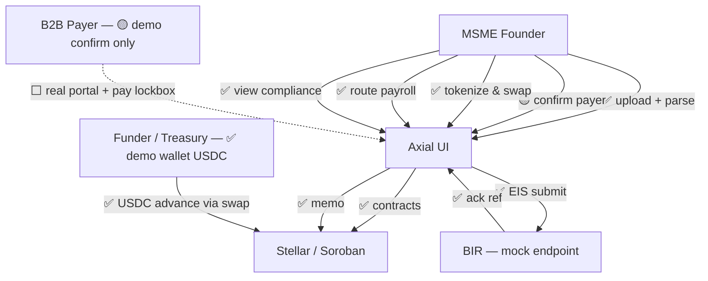

# Axial — App flow & feature scope (visual)

**Hackathon build:** testnet · May 2026  
**Legend:** `✅` built & wired · `🟡` UI/mock or partial · `⬜` planned (docs) · `❌` won't ship v1

**Aligned with:** `web/` app · `GET /api/dashboard/summary` · Supabase `ifzyntqwymmgimnxtguz`

---

## 1. Four tabs — what lives where

```mermaid
flowchart TB
  subgraph app [Axial Web App — Next.js 15]
    OV["/ Overview<br/>Command Center"]
    LQ["/liquidity<br/>Liquidity"]
    CP["/compliance<br/>Compliance"]
    ST["/settings<br/>Settings"]
  end

  OV --> OV1["✅ BIR EIS pulse — live API"]
  OV --> OV2["✅ Statutory pulse — chain status"]
  OV --> OV3["✅ Recent Actions — EIS feed"]
  OV --> OV4["✅ Liquidity headline — book from summary API"]
  OV --> OV5["🟡 Runway chart — demo bars + EIS activity hint"]
  OV --> OV6["✅ Testnet treasury — USDC/XLM balances"]

  LQ --> LQ1["✅ Upload PDF/XML — OCR parse + persist"]
  LQ --> LQ2["✅ Invoice table — Supabase/file + pagination"]
  LQ --> LQ3["🟡 Payer confirm + lockbox — demo buttons"]
  LQ --> LQ4["✅ Tokenize & Swap — testnet"]
  LQ --> LQ5["✅ Swap quote API — 85% advance"]
  LQ --> LQ6["✅ Pipeline progress — toast + sidebar"]
  LQ --> LQ7["✅ Stat tiles — treasury USDC + book + contracts"]

  CP --> CP1["✅ Payroll quote — contract math"]
  CP --> CP2["✅ Route Payroll — testnet*"]
  CP --> CP3["✅ BIR EIS table — Supabase"]
  CP --> CP4["✅ Expand 20 BIR fields"]
  CP --> CP5["🟡 Filing milestones — static"]

  ST --> ST1["🟡 Org / TIN forms — local UI"]
  ST --> ST2["🟡 Auto-route toggle — no backend"]
  ST --> ST3["✅ PDAX ramp — L2 demo card + toast"]

  style LQ3 fill:#3d3520
  style OV5 fill:#3d3520
  style CP5 fill:#3d3520
```

\* Payroll uses `lastSwapAdvancePhp` from context after swap (not full ₱1.25M demo gross).

---

## 2. Full product journey (vision — closed loop)

What Axial is **designed** to do per `Axial.md`, `prd-axial.md`, `rfc-axial-closed-loop-settlement.md`:

---

## 3. What happens today — demo path (testnet)

Use this for recordings and mental model:

---

## 4. Upload → fund path (built for demo)

```mermaid
flowchart TD
  U["MSME uploads PDF/XML"] --> P["✅ Parse: invoice #, buyer, amount, due"]
  P --> R["✅ Row in Liquidity table — Supabase or file fallback"]
  R --> PC["🟡 Confirm payer — PATCH demo"]
  PC --> NOA["🟡 NoA acknowledged — trust strip demo"]
  NOA --> OK["✅ Fundable — Tokenize & Swap enabled"]
  OK --> M["✅ Mint on Soroban"]
  M --> S["✅ Swap USDC"]
  S --> EIS["✅ EIS oracle auto-run"]
  EIS --> UI2["✅ Compliance + Overview update"]

  style PC fill:#3d3520
  style NOA fill:#3d3520
```

**Not built:** real payer portal, KYB, on-chain lockbox enforcement, leakage freeze worker.

---

## 5. System architecture (runtime)

---

## 6. EIS oracle — compliance brain

---

## 7. Feature scope matrix

| Feature | PRD priority | Hackathon L1 | Status |
|---------|--------------|--------------|--------|
| Payer KYB + confirm invoice | Must | 🟡 | Demo PATCH only |
| NoA e-acknowledgement | Must | 🟡 | Client trust strip + flags |
| Invoice upload + OCR | Implied UI | ✅ | Parse API + persist |
| Factoring book + pagination | Should | ✅ | Supabase `factoring_invoices` |
| SAC mint / receivable token | Must | ✅ | Testnet |
| Atomic USDC swap | Must | ✅ | Testnet |
| Payroll statutory split | Must | ✅ | Testnet |
| BIR EIS oracle 20 fields | Must | ✅ | Mock BIR + real pipeline |
| JWS + memo write-back | Must | ✅ | Mock JWS |
| Supabase / audit log | Should | ✅ | `eis_submissions` + invoices |
| Overview health dashboard | Must | ✅ | Live EIS + summary API + treasury |
| Liquidity stat tiles | Should | ✅ | Summary API |
| Closed-loop lockbox settlement | Must | 🟡 | Demo collect; no on-chain enforcement |
| PDAX PHP ramp UI | L2 | ✅ | Settings `PdaxRampCard` |
| Mainnet deploy | L1 | ⬜ | Testnet only |
| T+3 worker / due_by | SDD | ⬜ | Immediate submit only |
| Horizon event subscription | SDD | ⬜ | API hooks only |
| Auth / multi-tenant | Prod | ⬜ | Single demo org |
| Funder portal | Could | ❌ | v1 skip |

---

## 8. Layer roadmap (L1 / L2 / L3)

---

## 9. One-page actor view

---

## Quick reference — APIs

| Method | Path | Role |
|--------|------|------|
| GET | `/api/dashboard/summary` | Book totals, treasury USDC, EIS counts, contracts |
| GET | `/api/wallets/balances` | Per-wallet XLM + USDC (Overview treasury) |
| GET | `/api/invoices?page=&pageSize=` | Paginated factoring book |
| PATCH | `/api/invoices/[id]` | `confirm_payer`, `settle`, `mark_collected` |
| POST | `/api/invoices/parse` | OCR + upsert row |
| POST | `/api/invoices/seed?force=true` | Dev seed 12 rows |
| GET | `/api/soroban/status` | Chain + `eisStore` + contract IDs |
| GET | `/api/swap/quote?face=` | Advance math |
| POST | `/api/receivable/mint` | SAC mint |
| POST | `/api/swap/execute` | USDC advance |
| GET | `/api/payroll/quote?gross=` | SSS / PhilHealth / Pag-IBIG split |
| POST | `/api/payroll/route` | On-chain payroll |
| GET | `/api/eis/submissions` | Compliance + Overview |
| POST | `/api/eis/seed` | Dev demo rows |
| POST | `/api/eis/process` | Manual oracle replay |
| POST | `/api/bir/eis` | Mock BIR accept |

---

*Update this doc when Mainnet, real payer portal, or T+3 worker land.*
