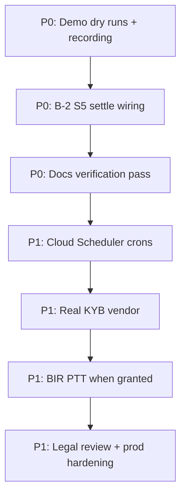

# Axial — Remaining Work & Priorities

**Version:** 1.0  
**Date:** 2026-06-14  
**Status:** Living backlog — update when items ship or scope changes

> Derived from [`Axial.md`](Axial.md) (implementation status), [`flow.md`](flow.md) (built/mock/planned matrix), and [`sprint.md`](sprint.md) (B-* task board). When this file conflicts with the code, **trust the code** and update here first, then propagate to [`Axial.md`](Axial.md).

---

## How to read this doc

| Symbol | Meaning |
|--------|---------|
| **P0** | Blocks a credible demo or submission story |
| **P1** | Production credibility; post-hackathon core |
| **P2** | Nice to have / gated on external access |
| **❌** | Dropped from v1 — do not reopen without editing [`Axial.md`](Axial.md) |

**Legend (matches [`flow.md`](flow.md)):** `✅` done · `🟡` partial · `⬜` not done · `❌` won't ship v1

---

## Already shipped (context)

Hackathon **L1 + L2** is largely complete:

- 4 Soroban contracts on **Stellar Mainnet** (mint, swap, payroll, settlement deployed + initialized)
- Liquidity + Compliance UI wired to chain
- BIR EIS oracle (mock BIR, JWS mock, memo write-back, T+3 worker, Horizon poll)
- Payer portal, NoA issue/ack, eligibility gate
- Supabase auth + multi-tenancy
- Reflector FX + PDAX mock UI
- Freighter self-custody path (optional alongside custodial server signing)
- Cloud Run deploy (`asia-southeast1`)

See [`Axial.md`](Axial.md) § "Implementation status" for the full table.

---

## P0 — Do before demo / submission

### 1. End-to-end demo reliability (S0-6)

**Status:** `🔴 todo` in [`sprint.md`](sprint.md)

- Record a clean demo video + run ≥3 dry runs
- Shot list: [`sprint.md`](sprint.md) § S0-6 (Landing → Overview → Liquidity upload/seed → confirm payer → tokenize & swap → Compliance EIS + payroll → Settings)
- **Website blockers to verify:** Freighter on Public network, USDC trustline, fundable row before Tokenize, toast shows real `Mint … · Swap …` hashes (not invoice id only)

**References:** [`flow.md`](flow.md) §3 sequence, [`pitch-script.md`](pitch-script.md)

---

### 2. Closed-loop settlement — on-chain `settle` (B-2 S5)

**Status:** `🟡` — S3–S4 done; **S5–S6 open**

| Step | Status | Notes |
|------|--------|-------|
| `register_invoice` after swap | ✅ | Fire-and-forget in `swap/execute` |
| Payer Freighter → lockbox USDC | ✅ | `/api/lockbox/fund/build` + payer portal |
| **`settle` + contract-balance pre-check** | ⬜ **S5** | Wire `settleOnChain` in app; verify full + partial paths on Mainnet |
| Reconcile + attribution hardening | ⬜ **S6** | Document trust model in [`rfc-axial-closed-loop-settlement.md`](rfc-axial-closed-loop-settlement.md) |

**Do not claim** full closed-loop enforcement in pitch until S5 lands ([`Axial.md`](Axial.md) build audit).

**Code:** `soroban/contracts/settlement/`, `web/lib/soroban/invoke-settlement.ts`, `web/app/api/reconciliation/scan/`

---

### 3. Docs sync — final verification pass

**Status:** `⬜` noted in [`sprint.md`](sprint.md) S0-7

- Reconcile [`Axial.md`](Axial.md) implementation status with current `web/` behavior
- Ensure [`flow.md`](flow.md) matrix matches Liquidity OCR, Freighter, and mainnet-only network cookie
- Mark S0-6 done when demo recording exists

---

## P1 — Production credibility (post-hackathon core)

### 4. GCP Cloud Scheduler for cron jobs

**Status:** `⬜` — HTTP endpoints exist; scheduler jobs may not be wired

| Job | Endpoint | Suggested schedule |
|-----|----------|-------------------|
| EIS T+3 worker | `POST /api/eis/worker` | Every 6h |
| Horizon event poll | `POST /api/eis/horizon-poll` | Every 10 min |
| Reconciliation scan | `POST /api/reconciliation/scan` | Daily |

Protect with `CRON_SECRET` (Bearer). Cloud Run has no built-in cron — use **GCP Cloud Scheduler** ([`sprint.md`](sprint.md) B-4).

---

### 5. Real payer KYB

**Status:** `⬜` — mock auto-verifies on payer create

- PRD Must-Have: real KYB before production ([`flow.md`](flow.md) matrix)
- State machine exists (`lib/payers/`); swap mock vendor for PDAX/KYB provider or manual review workflow

---

### 6. Live BIR EIS (PTT-gated)

**Status:** `⬜` code seam ready; **live path off by default**

- Set `BIR_EIS_LIVE=true` + real endpoint, API key, RS256 key when BIR grants **Permit to Transmit**
- Replace mock JWS secret with vault-backed signing ([`rfc-axial-eis-oracle.md`](rfc-axial-eis-oracle.md) production gaps)
- Checklist: [`sprint.md`](sprint.md) B-7

**References:** [`clr-axial.md`](clr-axial.md), `web/lib/eis/bir-client.ts`

---

### 7. Replace hardcoded demo values

**Status:** `⚠️` acknowledged in [`Axial.md`](Axial.md)

| Item | Current | Target |
|------|---------|--------|
| FX fallback | Hardcoded `56.5` when Reflector down | Acceptable fallback; monitor Reflector in prod |
| Seller/buyer TINs | `AXIAL_*` env defaults | Per-org config from Supabase |
| Settings audit log | Mix of live EIS + demo rows | EIS-only or labeled demo mode |

---

### 8. Legal & compliance artifacts

**Status:** counsel-needed ([`clr-axial.md`](clr-axial.md))

- Notice of Assignment **legal text** — licensed PH attorney review before production
- Privacy Policy, Terms of Use, liability-shift copy on Trust & Boundary screen
- Not code blockers for hackathon demo; **are** blockers for live MSME onboarding

---

## P2 — Gated or optional

### 9. Funder Protection Center / Funder portal

**Status:** `⬜` planned — **not** v1 skip long-term; see [`alignment-plan-axial.md`](alignment-plan-axial.md) **B-10**

PRD Should-Have (US-06): payer confirmed, NoA, reserve, recourse. **Build API-first** (`/api/funder/*`), embed in Liquidity, then optional `/app/funder-portal`.

| Step | Status |
|------|--------|
| B-10.1–6 Domain + API + Liquidity embed | ⬜ |
| B-10.7 Standalone funder portal | ✅ |
| Deal “Repaid” state in book | ⬜ blocked on B-2 S5 |

---

### 10. PDAX Connect API (L3)

**Status:** `❌` dropped — sandbox access not granted ([`Axial.md`](Axial.md), [`sprint.md`](sprint.md) B-9)

SEP-24 abstraction remains for future wiring. L2 mocked PDAX UI is in scope.

---

## Explicitly not pursuing (locked)

Do not reopen without updating [`Axial.md`](Axial.md) first:

| Item | Decision |
|------|----------|
| PHPC on Stellar | ❌ Retired |
| Direct QRPh SDK | ❌ Retired — anchor edge only |
| SDD modular monolith (BullMQ, separate backend) | Not build target — Next.js route handlers + Supabase ([`sdd-axial.md`](sdd-axial.md) v0.3 note) |
| Testnet as operating network | ❌ Mainnet only (testnet = dev sandbox) |

---

## Suggested build order

> Full alignment (MSME + payer + funder + settlement + docs): [`alignment-plan-axial.md`](alignment-plan-axial.md)

**If time is tight:** ship P0 items 1 and 3 only; call settlement “partially live” (S3–S4) in the pitch and point judges to receivable + swap contract history on Stellar Expert.

---

## Quick reference — where to look in code

| Area | Path |
|------|------|
| Mint / swap | `web/app/api/receivable/mint/`, `web/app/api/swap/execute/` |
| Payroll | `web/app/api/payroll/route/` |
| Settlement | `web/lib/soroban/invoke-settlement.ts`, `web/app/api/lockbox/fund/` |
| EIS oracle | `web/lib/eis/oracle.ts`, `web/app/api/eis/` |
| Payer / NoA | `web/app/api/payers/`, `web/app/api/noa/`, `web/app/app/payer-portal/` |
| Contracts | `soroban/contracts/`, `soroban/deployments/mainnet.json` |
| Deploy | `.github/workflows/deploy-cloudrun.yml`, `soroban/scripts/upload-gcp-mainnet-secrets.sh` |

---

## Changelog

| Date | Change |
|------|--------|
| 2026-06-14 | Initial backlog from implementation audit vs `Axial.md`, `flow.md`, `sprint.md` |
