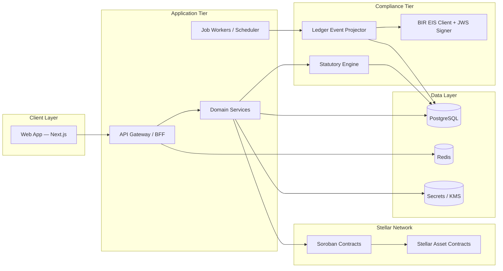
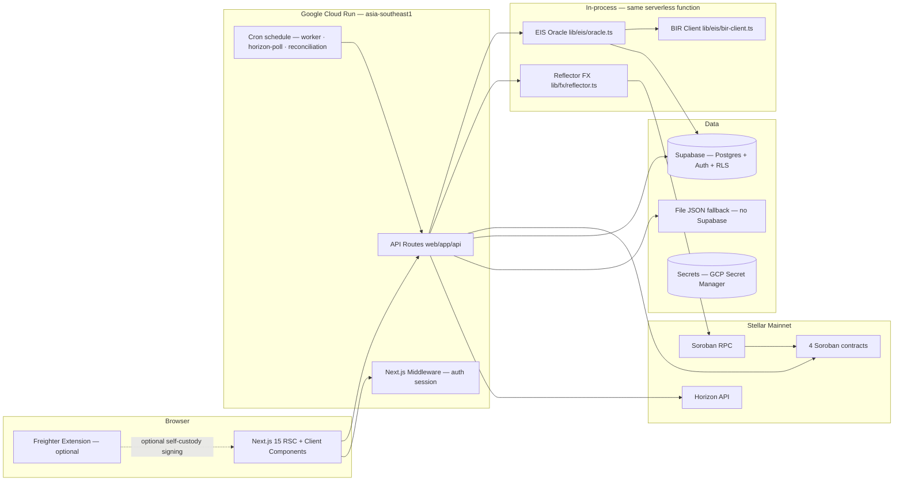

# System Design Document (SDD)

**Project:** Axial  
**Date:** 2026-05-14  
**Version:** 0.3  
**Owner:** Axial Product Lead  
**Status:** Live — updated 2026-05-22 to reflect v1 build reality  
**Foundation:** [Axial.md](../Axial.md)  
**PRD:** [prd-axial.md](prd-axial.md)

**Related:** [BRD](brd-axial.md) · [DSD](dsd-axial.md) · [GTM](gtm-axial.md)

---

> **⚠️ IMPLEMENTATION NOTE (2026-05-22)**
>
> This document was authored pre-build (2026-05-14) and described the intended
> modular-monolith architecture. The actual v1 build diverges in several key areas.
>
> **Rule: trust the code over this document wherever they conflict.** Use `docs/flow.md`
> for the built/mock/planned matrix and `CLAUDE.md` for the authoritative repo guide.
>
> The table below maps each major design decision to its v1 build reality.
>
> | Design intent | v1 build reality |
> |---|---|
> | Modular monolith with separate API gateway | **Next.js 15 API routes** under `web/app/api/` — no separate gateway, BFF pattern co-located |
> | BullMQ / Temporal job queue | **In-process fire-and-forget oracle** (`lib/eis/oracle.ts`) + scheduled retry/horizon-poll/reconciliation jobs (GCP Cloud Scheduler) |
> | Managed PostgreSQL | **Supabase** (project `ifzyntqwymmgimnxtguz`); file-fallback JSON store when Supabase not configured |
> | Redis distributed cache + locks | **Not in v1** — rate limits and locks omitted; no Redis dependency |
> | HashiCorp Vault / cloud KMS | **Env vars** — GCP Secret Manager on Cloud Run; production vault path preserved in design |
> | OIDC auth, vendor TBD | **Supabase Auth** — magic link OTP + Google OAuth; org auto-created by DB trigger on user insert |
> | `/v1/` prefixed REST API | **Next.js API routes** — no version prefix; route structure is `web/app/api/**` |
> | Separate compliance oracle service | **In-process** — `lib/eis/` runs in the same Next.js serverless function; fire-and-forget via `void processLedgerEvent().catch()` |
> | Mock → live BIR EIS toggle via code change | **Env-var switchable** — `BIR_EIS_LIVE=true` + `BIR_EIS_ENDPOINT` + `BIR_JWS_PRIVATE_KEY_B64`; no code change required |
> | Freighter / wallet connect: TBD | **Freighter implemented (B-3)** — optional alongside custodial path; `window.freighter` extension API |
> | Hosting: TBD | **Google Cloud Run** (`asia-southeast1`) via GitHub Actions (`deploy-cloudrun.yml`, `web/Dockerfile`, `output: standalone`) |

---

## 1. Architectural Vision and Principles

**Architecture style:** Modular monolith for v1 — clear module boundaries between web client, application services, Stellar/Soroban integration, and compliance oracle. A single API gateway handles all client traffic. Evolve to services when throughput or team parallelism demands it; the boundary design makes that migration clean.

**Guiding principles:**

- **Ledger truth, app explainability.** Stellar provides finality; Axial surfaces human-readable status, memo references, and audit links — operators never navigate raw blockchain explorers to understand what happened.
- **Idempotent compliance.** EIS submission and statutory routing side effects are retry-safe with deduplication keys and explicit state machines. A failed job retried never produces a duplicate BIR submission.
- **Secrets off the client.** Wallets, signing keys, and BIR credentials live in vault/HSM/KMS. Nothing sensitive lives in the browser beyond wallet-connect flows where applicable.
- **Philippines scope first.** Statutory rules and BIR EIS schema are versioned and configurable — no hard-coded "magic numbers." When brackets change, only the rule pack is updated, not the application logic.
- **Calm failure.** Failures surface as human-readable states with next steps, not raw error codes. The compliance tier is monitored aggressively; failures escalate to ops before they hit users.

**Key trade-offs:**

- **Off-chain oracle for BIR EIS.** The Stellar chain cannot call the BIR HTTP API directly. An attested off-chain oracle service reads ledger events, maps them to JSON, signs with JWS, and submits to BIR. Trade-off: trust and ops burden. Mitigated by: immutable memo write-backs, audit logs, retry discipline, and monitoring.
- **Single compliance queue in v1.** Simplifies T+3 scheduling and eliminates distributed coordination complexity at pilot scale. Documented debt: will need sharded workers at volume (design the queue interface to allow this without breaking consumers).
- **DB authoritative for UX state.** Stellar is the source of financial truth; PostgreSQL holds projections, job state, and user-facing entities for fast queries. Reading state from chain for every UI request is too slow and brittle.
- **Modular monolith over microservices.** Reduces operational complexity and deployment surface during the pilot phase. Module boundaries are enforced by code; extraction to services is a deployment change, not a rewrite.

---

## 2. High-Level Architecture

### Intended design (pre-build)



### v1 build reality (as of 2026-05-22)



**v1 layer responsibilities (actual):**

| Layer | Technology | Responsibility |
|---|---|---|
| Client | Next.js 15 RSC + React 19 client components | Four-tab app UX; Freighter wallet connect (optional); no long-lived secrets in browser |
| API + BFF | **Next.js Route Handlers** `web/app/api/` | Session via Supabase Auth middleware; org-scoped queries; command validation |
| In-process oracle | **`lib/eis/`** (same serverless function) | Fire-and-forget EIS pipeline; map ledger events → BIR schema; JWS sign; submit; memo write-back |
| BIR EIS client | **`lib/eis/bir-client.ts`** | Mock (HS256) today; live (RS256, real endpoint) via `BIR_EIS_LIVE=true` env var |
| FX oracle | **`lib/fx/reflector.ts`** | Reflector on-chain PHP/USDC rate; 5-min in-process cache; fallback 56.5 |
| Scheduled jobs | **GCP Cloud Scheduler** | Worker (6h), Horizon-poll (10min), reconciliation/scan (nightly) — HTTP calls to the Cloud Run service, protected by `CRON_SECRET` |
| Chain | **Stellar Mainnet** — 4 contracts (receivable, swap, payroll, settlement) | SAC mint, atomic swap, payroll split, settlement |
| Auth | **Supabase Auth** | Magic link OTP + Google OAuth; org auto-created on user insert via DB trigger |
| Data | **Supabase** (Postgres + RLS) or **JSON file fallback** | Submissions, invoices, payers, reserve ledger, orgs, memberships; RLS enforces org isolation |
| Secrets | **GCP Secret Manager** (Cloud Run) | Stellar keys, Supabase service role, BIR credentials; vault migration path preserved in design |

---

## 3. Data Architecture

> **v1 build reality:** Primary database is **Supabase** (hosted Postgres, project `ifzyntqwymmgimnxtguz`). Redis is **not present** in v1 — distributed locks and rate limits are omitted at pilot scale. File-based JSON fallback (`web/data/`) is used when `SUPABASE_URL` is not set (local dev). See `web/lib/eis/store.ts`, `web/lib/invoices/store.ts`, `web/lib/payers/store.ts`, `web/lib/settlement/store.ts` for the dual-backend pattern.

**Primary database:** PostgreSQL — relational model fits the org/invoice/batch/submission structure; supports idempotency key constraints natively.

**Cache:** Redis — distributed locks prevent duplicate job execution; rate limits protect BIR API quota; optional dashboard projection caching with TTL invalidated on chain finality. *(Deferred to v2 — not in v1 build.)*

**No vector store in v1** — no RAG requirement in PRD.

**Core entities (conceptual):**

```
Organization
  id, name, tin, bir_ptт_ref TBD, created_at

User
  id, org_id, role (owner | operator | viewer), auth_subject

Payer (B2B debtor — the closed-loop gate; see rfc-axial-closed-loop-settlement.md)
  id, org_id, legal_name, tin, kyb_status (pending | verified | rejected),
  contact_email, created_at

Invoice / Receivable
  id, org_id, payer_id, amount_php, currency, due_date, payment_terms_days,
  status (draft | awaiting_payer_confirmation | awaiting_noa_ack | fundable
          | tokenized | funded | settled | leaked | disputed | recourse),
  stellar_asset_ref TBD

InvoiceConfirmation
  id, receivable_id, payer_id, confirmed_amount, due_date,
  status (pending | confirmed | disputed), confirmed_at

NoticeOfAssignment (legal core — PH Civil Code Arts. 1624–1635)
  id, receivable_id, payer_id, noa_document_ref, lockbox_address,
  ack_status (issued | acknowledged | refused), ack_method (in_app | signed_pdf),
  acknowledged_at

Lockbox (per-invoice collection target; never reused)
  id, receivable_id, stellar_address, expected_amount, funded_amount,
  status (open | settled | leaked | disputed)

ReserveLedger (funder protection)
  id, receivable_id, advance_amount, reserve_held,
  recourse_status (none | triggered | recovered | written_off), released_at

LiquidityRequest / SwapRecord
  id, org_id, receivable_id, stellar_tx_hash, settlement_amount_usdc,  -- UI converts to PHP at display time
  advance_rate, discount_rate, reserve_held, repayment_due_date,
  status (pending | active | repaid | failed)

PayrollBatch
  id, org_id, period_start, period_end, status (draft | approved | executed),
  statutory_breakdown_ref TBD

EmployeeStatutoryLine
  id, batch_id, employee_ref, gross_amount, sss_employee, sss_employer,
  philhealth_employee, philhealth_employer, pagibig_employee, pagibig_employer,
  withholding_tax TBD

EisSubmission
  id, org_id, invoice_id, correlation_id, payload_hash, jws_ref,
  bir_reference_id, submitted_at, state (queued | submitted | accepted | failed | retrying),
  idempotency_key, stellar_memo_ref TBD, retry_count

AuditLog
  id, org_id, actor_id, action, entity_type, entity_id, occurred_at, metadata
```

**Key relationships:**
- Organization 1→N Users, Payers, Invoices, PayrollBatches, EisSubmissions
- Payer 1→N Invoices; Invoice 1→1 InvoiceConfirmation, 1→1 NoticeOfAssignment, 1→1 Lockbox, 1→1 ReserveLedger
- **Funding gate:** an Invoice is `fundable` only when its Payer is `kyb_status = verified` AND InvoiceConfirmation is `confirmed` AND NoticeOfAssignment is `acknowledged`. Enforced server-side at the single funding entry point — no bypass path.
- Invoice 1→1 or 1→N SwapRecord (one receivable can have one active funding at a time; policy TBD)
- Ledger event 1→N EisSubmission attempts (retries) — unique idempotency key enforced at DB level

**Caching strategy:** Dashboard projection reads cached with TTL (TBD — likely 30–60s); invalidate on chain finality event or submission state transition.

---

## 4. Stellar / Soroban Integration

**Soroban contract responsibilities:**

| Contract | What it does |
|---|---|
| SAC / Receivable Token | Mints a token for a **payer-confirmed, NoA-acknowledged** receivable; stores invoice metadata reference. Issued **clawback-enabled** so a token on a later-disproven invoice is revocable |
| Atomic Swap | Executes collateral-free USDC delivery to MSME against receivable token; asset address is a contract parameter; advances ~80–90% of face, retains a reserve, encodes discount + recourse terms |
| Statutory Payroll Router | Accepts gross payroll (asset address as parameter, USDC for hackathon demo); calculates statutory splits per encoded bracket tables; routes to employee wallets and government agency addresses. `AUTH_REQUIRED` keeps statutory tokens flowing only to whitelisted government addresses |
| Settlement | On payer payment **into the per-invoice lockbox**, repays the liquidity provider (principal + discount), releases the holdback reserve, and returns the residual margin to the MSME |
| Reconciliation (off-chain worker) | Scans open lockboxes; a due invoice with an empty lockbox by T+X flips Invoice→`leaked`, freezes the MSME, notifies the funder, and triggers recourse + blacklist |

**Ledger event flow:**
1. Transaction achieves consensus on Stellar (3–5 seconds)
2. Off-chain oracle service polls Horizon or Stellar RPC for events matching org's account/contract addresses
3. Oracle maps event metadata to BIR EIS 20-field schema
4. Oracle enqueues EIS submission job with idempotency key = `{org_id}:{stellar_tx_hash}:{invoice_id}`
5. EIS client job picks up, signs payload with JWS, submits to BIR
6. On BIR acknowledgement: writes `bir_reference_id` to `EisSubmission`, then writes a memo back to Stellar (or records memo reference TBD)
7. Failure: job retries with exponential backoff; after max retries, escalates to dead-letter queue and ops alert

**Stellar RPC / Horizon:** Use a provider with failover. Implement circuit breaker pattern. Never block user-facing request on chain confirmation; use async job + websocket or polling for state updates.

---

## 5. Compliance Architecture

> **v1 build reality:** The compliance oracle is **in-process** — it runs inside the same Next.js serverless function that handles the on-chain API routes. There is no separate oracle service or external job queue. The oracle fires-and-forgets via `void processLedgerEvent().catch()` so it does not block the user-facing response. Scheduled retry, horizon polling, and reconciliation run as GCP Cloud Scheduler jobs. The BIR EIS client is env-var switchable between mock and live (see `lib/eis/bir-client.ts`). JWS uses HS256 mock by default; switches to RS256 production key when `BIR_EIS_LIVE=true`. See `docs/rfc-axial-eis-oracle.md` for the detailed design.

### BIR EIS Oracle

**Off-chain by design** — BIR uses HTTPS API; Stellar contracts cannot make HTTP calls. The oracle is a trusted service in the application tier.

**The 20 mandatory BIR EIS fields** (must be mapped from Stellar event metadata):
Invoice number, invoice date, seller TIN, seller name, seller address, buyer TIN (if registered), buyer name, buyer address, description of goods/services, quantity, unit of measure, unit price, gross amount, VAT-exempt amount, zero-rated amount, taxable amount, VAT amount (12%), total amount due, transaction type, and payment mode.

**JWS signing:** The BIR requires JSON Web Signature using the enterprise's registered private key. This key lives in vault — never in application code, never in environment variables. The signing operation happens in the oracle service with vault-mediated key access.

**T+3 scheduling:** The job worker must guarantee submission within 3 calendar days of transaction date. Job enqueued immediately on ledger event; T+3 deadline stored as `due_by` on the EisSubmission record. Worker monitors `due_by` and escalates if approaching without a successful submission.

**PTT requirement:** BIR requires a Permit to Transmit before production submission. Staging/mock path needed for development and hackathon MVP. PTT certification process: TBD — track as open decision in [Axial.md §11](../Axial.md).

### Statutory Engine

**Contribution brackets** (SSS, PhilHealth, Pag-IBIG) are encoded as versioned rule packs — not hard-coded constants. When the BSP or SSS updates brackets, only the rule pack is updated and the next payroll run picks up the new tables.

**Employee classification matters:** Regular employees, contractual workers, and probationary employees have different contribution obligations. Classification is captured at employee registration.

**Employer share:** Axial computes and routes both employee deduction and employer counterpart contribution in the same payroll contract execution. Manual employer share tracking is eliminated.

---

## 6. API Design

**Style:** REST with OpenAPI spec — preferred for clarity, tooling, and BIR API compatibility. tRPC as an alternative if frontend/backend are co-located in the same TypeScript codebase (decide with engineering team).

**Versioning:** `/v1/` prefix on all routes from day one.

**Illustrative endpoints:**

| Method | Path | Purpose |
|---|---|---|
| `POST` | `/v1/payers` | Onboard B2B payer (MSME-initiated); starts KYB |
| `GET` | `/v1/payers/:id` | Payer KYB status |
| `POST` | `/v1/receivables` | Register receivable for tokenization |
| `POST` | `/v1/receivables/:id/confirm` | Payer confirms invoice + due date (payer-scoped token) |
| `POST` | `/v1/noa/:receivableId/issue` | Issue Notice of Assignment; returns lockbox address |
| `POST` | `/v1/noa/:receivableId/ack` | Payer e-acknowledges NoA |
| `GET` | `/v1/receivables/:id/eligibility` | Funding gate — `{ fundable, blockers[] }` |
| `POST` | `/v1/disputes` | Payer/MSME raises a dispute |
| `POST` | `/v1/liquidity/requests` | Initiate funding / swap orchestration (rejects `409 NOT_FUNDABLE` if gate fails) |
| `GET` | `/v1/liquidity/requests/:id` | Poll swap status (pending → active → repaid) |
| `GET` | `/v1/overview` | Aggregated health for Overview tab |
| `POST` | `/v1/payroll/batches` | Create payroll batch |
| `GET` | `/v1/payroll/batches/:id/preview` | Preview statutory breakdown before execution |
| `POST` | `/v1/payroll/batches/:id/approve` | Approve and execute payroll batch |
| `GET` | `/v1/compliance/eis` | List EIS submissions with state and BIR references |
| `POST` | `/v1/compliance/eis/submit` | Manually trigger EIS submission (if not fully automatic) |

**SwapRecord response shape (API layer):** The `GET /v1/liquidity/requests/:id` response includes both `settlement_amount_usdc` (the on-chain USDC amount) and `settlement_amount_php_display` (derived at the API layer via the current FX rate). All financial fields on this response are returned in both USDC and PHP display values so the client never performs FX math directly.

**External integrations:**

| Service | Purpose | Reliability posture |
|---|---|---|
| Stellar / Horizon or RPC | Submit txs, query finality, read contract state | Provider failover; exponential backoff; circuit breaker |
| BIR EIS API | JSON submission, acknowledgements | Queue with DLQ; manual reconciliation path on persistent failure |
| Wallet connect / custody | User/org signing flows | Vendor TBD; never log raw keys |
| Email / SMS | Calm notifications only | Throttle; no URGENT defaults per brand voice |

---

## 7. Security and Authorization

> **v1 build reality:** Auth is **Supabase Auth** — magic link OTP + Google OAuth. Sessions managed via HttpOnly cookies set by `@supabase/ssr` middleware. Org auto-created by a PostgreSQL trigger on `auth.users` insert. RBAC is enforced at the API route level (service-role queries for admin, user session for user-scoped reads) and at the DB level via Row Level Security (`auth_org_ids()` helper function). Freighter wallet is optional self-custody alongside server-side custodial signing. See `web/middleware.ts` and `supabase/migrations/006_auth_multitenancy.sql`.

**Authentication:** OIDC with org-scoped invites (recommended for B2B MSME). Vendor TBD. HttpOnly cookie + short-lived access token + refresh token. *(Implemented: Supabase Auth — see v1 build reality above.)*

**Authorization:** Org-scoped RBAC for v1:
- `owner` — full access including settings, wallet management, approval
- `operator` — execute payroll, view compliance, initiate liquidity requests
- `viewer` — read-only across all tabs

Every database query filters by `org_id`. No cross-tenant data leakage.

**Data protection:**
- PII and payroll data encrypted at rest (DB-level or column-level) — TBD per hosting choice
- All secrets via KMS / vault with rotation policy TBD
- Input validation on all mutating APIs (Zod for TypeScript, Pydantic for Python workers)
- BIR private key — vault-mediated access only; never materialized in memory longer than the signing operation

**No secrets in client:** Wallet connect flows use session-scoped ephemeral keys at most. BIR credentials, signing keys, and liquidity provider API keys never leave the server tier.

---

## 8. Infrastructure, CI/CD, and Deployment

> **v1 build reality:** Hosting is **Google Cloud Run** (`asia-southeast1`) — `web/Dockerfile`, `output: standalone`, deployed by GitHub Actions (`deploy-cloudrun.yml`) on push to `main`. No Redis in v1. Secrets in GCP Secret Manager. The scheduled jobs (worker, horizon-poll, reconciliation) run as GCP Cloud Scheduler jobs — Cloud Run has no built-in cron. Local dev uses `npm run dev` from `web/` against Stellar Mainnet (demo/mock mode unless `MAINNET_*` secrets are set). Soroban contracts built and deployed from WSL (`make deploy-all`).

**Hosting:** Google Cloud Run (`asia-southeast1`), deployed by GitHub Actions on push to `main`.

**Environments:**

| Environment | Description |
|---|---|
| `dev` | Local `npm run dev` — Stellar Mainnet config; demo/mock mode unless `MAINNET_*` secrets are set; mock BIR EIS endpoint; file fallback if Supabase not configured |
| `staging` / `preview` | Per-branch preview builds; Stellar Mainnet; Supabase same project |
| `prod` | Cloud Run (`asia-southeast1`); Supabase production project; Stellar Mainnet (all 4 contracts deployed); real BIR EIS if PTT granted |

**CI/CD:** Lint → typecheck → tests on every PR; gated deploy to staging; migration strategy: expand/contract pattern (add column → backfill → make non-nullable → drop old). No destructive migrations without rollback plan.

**Secrets management:** Never in `.env` files committed to source control. Never in CI environment variables visible in logs. Vault or cloud secret manager from day one.

---

## 9. Non-Functional Requirements

| Requirement | Target | Notes |
|---|---|---|
| API response p95 | < 400ms | Excluding chain broadcast wait; chain operations are async |
| EIS submission within T+3 | 100% of eligible events | Monitored aggressively; alerts if approaching deadline without success |
| Uptime | 99.5% | Compliance tier monitored independently |
| Concurrent orgs (v1) | TBD pilot size | Scale path: read replicas + sharded workers |
| Statutory accuracy | 100% match to current BIR/SSS/PhilHealth/Pag-IBIG tables | Legal sign-off required before production |

---

## 10. AI / Agent Architecture

Not applicable to core v1 flows. If future features add LLM assistance (e.g., anomaly explanation, document field extraction for invoice registration), add a dedicated section and RFC — do not embed in existing domain services without isolation.

---

## Self-Check

- [x] Section 2 includes architecture diagrams — both intended design and v1 build reality
- [x] Section 3 defines core entities with field-level detail; build-reality note added
- [x] Section 4 covers Soroban contracts and EIS oracle flow end-to-end
- [x] External integrations include reliability posture
- [x] Section 7 covers auth, RBAC, and secrets — build reality (Supabase Auth) documented
- [x] Section 8 updated to reflect Cloud Run deployment
- [x] Top-level implementation note table maps every design decision to v1 build reality
- [ ] Exact BIR schema version and Soroban contract interfaces to be locked in RFCs
- [ ] NFR numbers to be validated after pilot sizing
- [ ] PTT certification timeline to be tracked as open decision (BIR_EIS_LIVE switchover path ready)
- [ ] Redis + vault migration path: design preserved in §2 intended architecture; implement in v2
