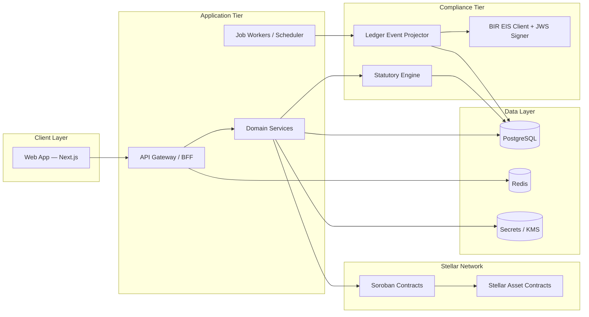

# System Design Document (SDD)

**Project:** Axial  
**Date:** 2026-05-14  
**Version:** 0.2  
**Owner:** Axial Product Lead  
**Status:** Draft  
**Foundation:** [Axial.md](../Axial.md)  
**PRD:** [prd-axial.md](prd-axial.md)

**Related:** [BRD](brd-axial.md) · [DSD](dsd-axial.md) · [GTM](gtm-axial.md)

---

## 1. Architectural Vision and Principles

**Architecture style:** Modular monolith for v1 — clear module boundaries between web client, application services, Stellar/Soroban integration, and compliance oracle. A single API gateway handles all client traffic. Evolve to services when throughput or team parallelism demands it; the boundary design makes that migration clean.

**Guiding principles:**

- **Ledger truth, app explainability.** Stellar provides finality; Axial surfaces human-readable status, memo references, and audit links — operators never navigate raw blockchain explorers to understand what happened.
- **Idempotent compliance.** EIS submission and statutory routing side effects are retry-safe with deduplication keys and explicit state machines. A failed job retried never produces a duplicate BIR submission.
- **Secrets off the client.** Wallets, signing keys, and BIR credentials live in vault/HSM/KMS. Nothing sensitive lives in the browser beyond wallet-connect flows where applicable.
- **Philippines scope first.** Statutory rules and BIR EIS schema are versioned and configurable — no hard-coded "magic numbers." When brackets change, only the rule pack is updated, not the application logic.
- **Calm failure.** Failures surface as human-readable states with next steps, not raw error codes. The compliance tier is monitored aggressively; failures escalate to ops before they hit users.

**Key trade-offs:**

- **Off-chain oracle for BIR EIS.** The Stellar chain cannot call the BIR HTTP API directly. An attested off-chain oracle service reads ledger events, maps them to JSON, signs with JWS, and submits to BIR. Trade-off: trust and ops burden. Mitigated by: immutable memo write-backs, audit logs, retry discipline, and monitoring.
- **Single compliance queue in v1.** Simplifies T+3 scheduling and eliminates distributed coordination complexity at pilot scale. Documented debt: will need sharded workers at volume (design the queue interface to allow this without breaking consumers).
- **DB authoritative for UX state.** Stellar is the source of financial truth; PostgreSQL holds projections, job state, and user-facing entities for fast queries. Reading state from chain for every UI request is too slow and brittle.
- **Modular monolith over microservices.** Reduces operational complexity and deployment surface during the pilot phase. Module boundaries are enforced by code; extraction to services is a deployment change, not a rewrite.

---

## 2. High-Level Architecture



**Layer responsibilities:**

| Layer | Technology | Responsibility |
|---|---|---|
| Client | Next.js 15, React 19, TypeScript, Tailwind CSS 4 | Four-tab UX per [DSD](dsd-axial.md); wallet connect TBD; no long-lived secrets in browser |
| API Gateway / BFF | REST (OpenAPI) or tRPC — decision TBD | Session management, org tenancy, command validation, rate limiting |
| Domain Services | Same runtime as API (monolith) | Invoice/receivable lifecycle, swap orchestration, payroll batch projections |
| Job Workers | BullMQ or Temporal (TBD) | T+3 scheduling, retries, reconciliation sweeps, oracle polling |
| Chain | Stellar / Soroban | SAC mint and transfer, atomic swaps, settlement hooks, memo write-backs |
| Compliance — Oracle | Off-chain service | Ledger event subscription, field mapping to BIR EIS schema |
| Compliance — EIS Client | Off-chain service | JWS signing, BIR API submission, acknowledgement parsing, retry with idempotency |
| Compliance — Statutory | Module within services | Contribution bracket computation (SSS, PhilHealth, Pag-IBIG), payroll routing instructions |
| Data — PostgreSQL | Managed PostgreSQL | Tenancy, projections, submission state, idempotency keys, audit log |
| Data — Redis | Managed Redis | Distributed locks for workers, rate limits, short-lived session assists |
| Data — Vault / KMS | HashiCorp Vault or cloud KMS | Signing keys, BIR credentials, wallet private material — never in env files or source control |

---

## 3. Data Architecture

**Primary database:** PostgreSQL — relational model fits the org/invoice/batch/submission structure; supports idempotency key constraints natively.

**Cache:** Redis — distributed locks prevent duplicate job execution; rate limits protect BIR API quota; optional dashboard projection caching with TTL invalidated on chain finality.

**No vector store in v1** — no RAG requirement in PRD.

**Core entities (conceptual):**

```
Organization
  id, name, tin, bir_ptт_ref TBD, created_at

User
  id, org_id, role (owner | operator | viewer), auth_subject

Invoice / Receivable
  id, org_id, buyer_ref TBD, amount_php, currency, due_date,
  payment_terms_days, status (draft | tokenized | funded | settled), stellar_asset_ref TBD

LiquidityRequest / SwapRecord
  id, org_id, receivable_id, stellar_tx_hash, settlement_amount_usdc,  -- UI converts to PHP at display time
  discount_rate, repayment_due_date, status (pending | active | repaid | failed)

PayrollBatch
  id, org_id, period_start, period_end, status (draft | approved | executed),
  statutory_breakdown_ref TBD

EmployeeStatutoryLine
  id, batch_id, employee_ref, gross_amount, sss_employee, sss_employer,
  philhealth_employee, philhealth_employer, pagibig_employee, pagibig_employer,
  withholding_tax TBD

EisSubmission
  id, org_id, invoice_id, correlation_id, payload_hash, jws_ref,
  bir_reference_id, submitted_at, state (queued | submitted | accepted | failed | retrying),
  idempotency_key, stellar_memo_ref TBD, retry_count

AuditLog
  id, org_id, actor_id, action, entity_type, entity_id, occurred_at, metadata
```

**Key relationships:**
- Organization 1→N Users, Invoices, PayrollBatches, EisSubmissions
- Invoice 1→1 or 1→N SwapRecord (one receivable can have one active funding at a time; policy TBD)
- Ledger event 1→N EisSubmission attempts (retries) — unique idempotency key enforced at DB level

**Caching strategy:** Dashboard projection reads cached with TTL (TBD — likely 30–60s); invalidate on chain finality event or submission state transition.

---

## 4. Stellar / Soroban Integration

**Soroban contract responsibilities:**

| Contract | What it does |
|---|---|
| SAC / Receivable Token | Mints a token representing a verified accounts receivable; stores invoice metadata reference |
| Atomic Swap | Executes collateral-free USDC delivery to MSME against receivable token; asset address is a contract parameter; encodes discount terms and repayment conditions |
| Statutory Payroll Router | Accepts gross payroll (asset address as parameter, USDC for hackathon demo); calculates statutory splits per encoded bracket tables; routes to employee wallets and government agency addresses |
| Settlement | On buyer payment, routes repayment to liquidity provider and margin to MSME |

**Ledger event flow:**
1. Transaction achieves consensus on Stellar (3–5 seconds)
2. Off-chain oracle service polls Horizon or Stellar RPC for events matching org's account/contract addresses
3. Oracle maps event metadata to BIR EIS 20-field schema
4. Oracle enqueues EIS submission job with idempotency key = `{org_id}:{stellar_tx_hash}:{invoice_id}`
5. EIS client job picks up, signs payload with JWS, submits to BIR
6. On BIR acknowledgement: writes `bir_reference_id` to `EisSubmission`, then writes a memo back to Stellar (or records memo reference TBD)
7. Failure: job retries with exponential backoff; after max retries, escalates to dead-letter queue and ops alert

**Stellar RPC / Horizon:** Use a provider with failover. Implement circuit breaker pattern. Never block user-facing request on chain confirmation; use async job + websocket or polling for state updates.

---

## 5. Compliance Architecture

### BIR EIS Oracle

**Off-chain by design** — BIR uses HTTPS API; Stellar contracts cannot make HTTP calls. The oracle is a trusted service in the application tier.

**The 20 mandatory BIR EIS fields** (must be mapped from Stellar event metadata):
Invoice number, invoice date, seller TIN, seller name, seller address, buyer TIN (if registered), buyer name, buyer address, description of goods/services, quantity, unit of measure, unit price, gross amount, VAT-exempt amount, zero-rated amount, taxable amount, VAT amount (12%), total amount due, transaction type, and payment mode.

**JWS signing:** The BIR requires JSON Web Signature using the enterprise's registered private key. This key lives in vault — never in application code, never in environment variables. The signing operation happens in the oracle service with vault-mediated key access.

**T+3 scheduling:** The job worker must guarantee submission within 3 calendar days of transaction date. Job enqueued immediately on ledger event; T+3 deadline stored as `due_by` on the EisSubmission record. Worker monitors `due_by` and escalates if approaching without a successful submission.

**PTT requirement:** BIR requires a Permit to Transmit before production submission. Staging/mock path needed for development and hackathon MVP. PTT certification process: TBD — track as open decision in [Axial.md §11](../Axial.md).

### Statutory Engine

**Contribution brackets** (SSS, PhilHealth, Pag-IBIG) are encoded as versioned rule packs — not hard-coded constants. When the BSP or SSS updates brackets, only the rule pack is updated and the next payroll run picks up the new tables.

**Employee classification matters:** Regular employees, contractual workers, and probationary employees have different contribution obligations. Classification is captured at employee registration.

**Employer share:** Axial computes and routes both employee deduction and employer counterpart contribution in the same payroll contract execution. Manual employer share tracking is eliminated.

---

## 6. API Design

**Style:** REST with OpenAPI spec — preferred for clarity, tooling, and BIR API compatibility. tRPC as an alternative if frontend/backend are co-located in the same TypeScript codebase (decide with engineering team).

**Versioning:** `/v1/` prefix on all routes from day one.

**Illustrative endpoints:**

| Method | Path | Purpose |
|---|---|---|
| `POST` | `/v1/receivables` | Register receivable for tokenization |
| `POST` | `/v1/liquidity/requests` | Initiate funding / swap orchestration |
| `GET` | `/v1/liquidity/requests/:id` | Poll swap status (pending → active → repaid) |
| `GET` | `/v1/overview` | Aggregated health for Overview tab |
| `POST` | `/v1/payroll/batches` | Create payroll batch |
| `GET` | `/v1/payroll/batches/:id/preview` | Preview statutory breakdown before execution |
| `POST` | `/v1/payroll/batches/:id/approve` | Approve and execute payroll batch |
| `GET` | `/v1/compliance/eis` | List EIS submissions with state and BIR references |
| `POST` | `/v1/compliance/eis/submit` | Manually trigger EIS submission (if not fully automatic) |

**SwapRecord response shape (API layer):** The `GET /v1/liquidity/requests/:id` response includes both `settlement_amount_usdc` (the on-chain USDC amount) and `settlement_amount_php_display` (derived at the API layer via the current FX rate). All financial fields on this response are returned in both USDC and PHP display values so the client never performs FX math directly.

**External integrations:**

| Service | Purpose | Reliability posture |
|---|---|---|
| Stellar / Horizon or RPC | Submit txs, query finality, read contract state | Provider failover; exponential backoff; circuit breaker |
| BIR EIS API | JSON submission, acknowledgements | Queue with DLQ; manual reconciliation path on persistent failure |
| Wallet connect / custody | User/org signing flows | Vendor TBD; never log raw keys |
| Email / SMS | Calm notifications only | Throttle; no URGENT defaults per brand voice |

---

## 7. Security and Authorization

**Authentication:** OIDC with org-scoped invites (recommended for B2B MSME). Vendor TBD. HttpOnly cookie + short-lived access token + refresh token.

**Authorization:** Org-scoped RBAC for v1:
- `owner` — full access including settings, wallet management, approval
- `operator` — execute payroll, view compliance, initiate liquidity requests
- `viewer` — read-only across all tabs

Every database query filters by `org_id`. No cross-tenant data leakage.

**Data protection:**
- PII and payroll data encrypted at rest (DB-level or column-level) — TBD per hosting choice
- All secrets via KMS / vault with rotation policy TBD
- Input validation on all mutating APIs (Zod for TypeScript, Pydantic for Python workers)
- BIR private key — vault-mediated access only; never materialized in memory longer than the signing operation

**No secrets in client:** Wallet connect flows use session-scoped ephemeral keys at most. BIR credentials, signing keys, and liquidity provider API keys never leave the server tier.

---

## 8. Infrastructure, CI/CD, and Deployment

**Hosting:** Cloud provider TBD — select for acceptable latency to Philippine operators and a viable BIR API connectivity path. Target region: Asia Pacific (Singapore or Manila proximity).

**Environments:**

| Environment | Description |
|---|---|
| `dev` | Local + Stellar Testnet; mock BIR EIS endpoint; no real money |
| `staging` | Mirrors prod topology; Stellar Testnet or sterile mainnet; BIR sandbox if available |
| `prod` | HA PostgreSQL with backups; managed Redis; secrets in vault; Stellar Mainnet; real BIR EIS API |

**CI/CD:** Lint → typecheck → tests on every PR; gated deploy to staging; migration strategy: expand/contract pattern (add column → backfill → make non-nullable → drop old). No destructive migrations without rollback plan.

**Secrets management:** Never in `.env` files committed to source control. Never in CI environment variables visible in logs. Vault or cloud secret manager from day one.

---

## 9. Non-Functional Requirements

| Requirement | Target | Notes |
|---|---|---|
| API response p95 | < 400ms | Excluding chain broadcast wait; chain operations are async |
| EIS submission within T+3 | 100% of eligible events | Monitored aggressively; alerts if approaching deadline without success |
| Uptime | 99.5% | Compliance tier monitored independently |
| Concurrent orgs (v1) | TBD pilot size | Scale path: read replicas + sharded workers |
| Statutory accuracy | 100% match to current BIR/SSS/PhilHealth/Pag-IBIG tables | Legal sign-off required before production |

---

## 10. AI / Agent Architecture

Not applicable to core v1 flows. If future features add LLM assistance (e.g., anomaly explanation, document field extraction for invoice registration), add a dedicated section and RFC — do not embed in existing domain services without isolation.

---

## Self-Check

- [x] Section 2 includes architecture diagram (Mermaid)
- [x] Section 3 defines core entities with field-level detail
- [x] Section 4 covers Soroban contracts and EIS oracle flow end-to-end
- [x] External integrations include reliability posture
- [x] Section 7 covers auth, RBAC, and secrets
- [ ] Exact BIR schema version and Soroban contract interfaces to be locked in RFCs
- [ ] NFR numbers to be validated after pilot sizing
- [ ] PTT certification timeline to be tracked as open decision
