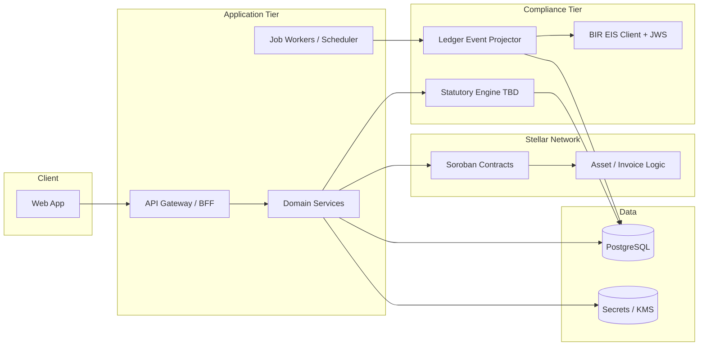

# System Design Document (SDD)

**Project:** Axial  
**Date:** 2026-05-11  
**Version:** 0.1  
**Owner:** Axial Product Lead  
**PRD:** [prd-axial.md](prd-axial.md)

**Related:** [BRD](brd-axial.md) · [Design System](design-system-axial.md) · [Go-To-Market](gtm-axial.md)

---

## 1. Architectural Vision & Principles

**Architecture style:** **Modular monolith** (or small services behind a single API gateway) for v1, with a **clear boundary** between the **web client**, **application services**, **Stellar/Soroban integration layer**, and **compliance oracle / BIR bridge**—evolve to services when throughput or team parallelism demands it.

**Guiding principles:**

- **Ledger truth, app explainability:** Stellar provides finality; Axial surfaces human-readable status, memos, and audit links—never only raw explorer hashes for operators.  
- **Idempotent compliance:** EIS submission and payroll-adjacent side effects are **retry-safe** with deduplication keys and explicit state machines.  
- **Secrets off the client:** Wallets, signing keys, and BIR credentials live in **vault / HSM / KMS** patterns—never in the browser beyond wallet connect flows where applicable.  
- **Philippine scope first:** Statutory rules and EIS schema are versioned; hard-coded “magic” is avoided in favor of configurable rule packs **TBD**.

**Key trade-offs:**

- **Off-chain oracle for BIR EIS** — chain does not speak HTTP to BIR; an **attested** off-chain service maps ledger events → JSON + JWS. Trade-off: trust and ops burden; mitigated by audit logs, memo write-backs, and monitoring.  
- **Single compliance queue in v1** — simplifies T+3 scheduling; may need **sharded workers** at scale (documented debt).  
- **DB authoritative for UX state** — chain is source of financial truth; Postgres (or equivalent) holds projections, job state, and user-facing entities for fast queries.

---

## 2. High-Level Architecture



**Layers:**

| Layer | Technology (initial posture) | Responsibility |
|-------|------------------------------|----------------|
| Client | Web framework **TBD** (e.g. React / Next) per [design system](design-system-axial.md) | Four-tab UX; wallet connect **TBD**; no long-lived secrets |
| API / Gateway | **TBD** — REST or GraphQL + auth middleware | Sessions, org tenancy, command validation |
| Service / Compute | Same runtime as API or worker pool | Invoice/receivable lifecycle, swap orchestration, payroll batch projections |
| Jobs | Queue + workers **TBD** (e.g. BullMQ, Celery, Temporal) | T+3 scheduling, retries, reconciliation sweeps |
| Chain | Stellar / Soroban | SAC mint, atomic swaps, settlement hooks, memos |
| Compliance | Dedicated modules | Event projection, EIS mapping, statutory splits |
| Data | PostgreSQL | Tenancy, projections, submission state, idempotency keys |
| Infrastructure | **TBD** — container hosts / managed DB | Encryption in transit, backups, env separation |

---

## 3. Data Architecture

**Primary database:** **PostgreSQL** — relational model fits orgs, invoices, batches, submission records, and idempotency.  
**Secondary / cache:** **Redis** (recommended) — rate limits, distributed locks for workers, short-lived session assists **TBD**.  
**Vector store:** N/A for v1 product core (no RAG requirement in PRD).

**Core entities (conceptual):**

```
Organization
  id, name, created_at, …
User
  id, org_id, role, auth_subject, …
Invoice / Receivable
  id, org_id, buyer_ref TBD, amount, currency, due_terms, status, …
LiquidityRequest / SwapRecord
  id, org_id, receivable_ref, stellar_tx_hash, phpc_amount, discount_terms TBD, status, …
PayrollBatch
  id, org_id, period, status, statutory_breakdown_ref TBD, …
EisSubmission
  id, org_id, correlation_id, payload_ref, jws_ref, bir_reference_id, submitted_at, state, idempotency_key, stellar_memo_ref TBD, …
```

**Key relationships:**

- Organization **1—N** Users, Invoices, Batches, Submissions  
- Receivable **1—1 or 1—N** SwapRecord (policy TBD)  
- Ledger event **1—N** EisSubmission attempts (retries) with **unique idempotency**

**Caching strategy:** Read-heavy dashboard projections cached with TTL **TBD**; invalidate on chain finality or submission state change.

---

## 4. API Design & External Integrations

**API style:** **REST** or **tRPC/GraphQL** — choose one stack with PRD team; document OpenAPI when REST.

**Internal endpoints (illustrative):**

| Method | Path | Purpose |
|--------|------|---------|
| `POST` | `/v1/receivables` | Create/register receivable for tokenization path |
| `POST` | `/v1/liquidity/requests` | Initiate funding / swap orchestration |
| `GET` | `/v1/overview` | Aggregated health for Overview tab |
| `POST` | `/v1/payroll/batches` | Create or approve payroll batch |
| `POST` | `/v1/compliance/eis/submit` | Trigger or enqueue EIS (if not fully automatic) |

**External integrations:**

| Service | Purpose | Rate Limits / Fallback |
|---------|---------|------------------------|
| Stellar / Horizon (or RPC provider) | Submit txs, query finality, read contract state | Provider failover; exponential backoff; circuit breaker |
| BIR EIS API | JSON submission, acknowledgements | TBD per BIR spec — queue, DLQ, manual reconciliation path |
| Wallet / custody | User/org signing | Vendor **TBD** — never log raw keys |
| Email / SMS (optional) | Calm notifications | Throttle; no “URGENT” default copy per brand |

---

## 5. Security & Authorization

**Authentication:** **TBD** — enterprise-oriented SSO or OIDC + org invites recommended for B2B MSME **TBD**.  
**Session management:** HttpOnly cookies or secure token pattern; short-lived access + refresh **TBD**.  
**Authorization model:** Org-scoped **RBAC** minimal for v1: Owner vs Operator vs Read-only **TBD**; enforce on every query by `org_id`.

**Data protection:**

- PII and payroll data encrypted at rest **TBD** (DB-level or column-level).  
- Secrets via **KMS** / vault; rotation policy **TBD**.  
- Input validation on all mutating APIs (e.g. Zod / Pydantic).

---

## 6. Infrastructure, CI/CD & Deployment

**Hosting:** **TBD** — target cloud region with acceptable latency to PH operators and BIR connectivity path.

**Environments:**

- `dev` — local + testnet Soroban **TBD**  
- `staging` — mirrors prod topology; testnet or sterile mainnet **TBD**  
- `prod` — HA DB, backups, secret management

**CI/CD:** Lint, typecheck, tests on PR; gated deploy; migration strategy **TBD** (expand/contract or sequential).

---

## 7. Non-Functional Requirements

| Requirement | Target | Notes |
|-------------|--------|-------|
| API response (p95) | < 400ms | Excluding chain broadcast wait |
| On-chain inclusion | TBD | User sees pending → final states |
| Uptime | 99.5% | Compliance tier monitored aggressively |
| Concurrent orgs (v1) | TBD pilot size | Scale path: read replicas + workers |

---

## 8. AI / Agent Architecture

**Not applicable** to core v1 flows in PRD. If future features add LLM assistance (e.g. anomaly explanation), add a dedicated section and RFC.

---

## Self-Check

- [x] Section 2 includes a diagram  
- [x] Section 3 defines core entities (field-level DDL deferred)  
- [x] External integrations include fallback posture at high level  
- [ ] Exact BIR schema version and Soroban contract interface locked in RFCs  
- [ ] NFR numbers validated after pilot sizing  
